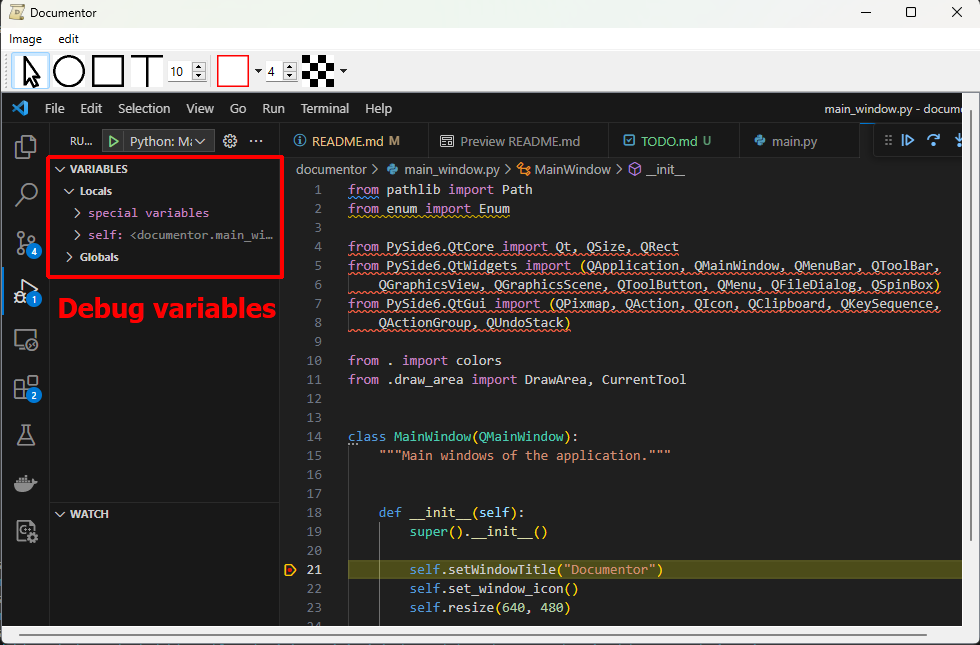

# documentor

Basic graphical app aiming at adding documentation to screenshots.



## Features

* Import/copy paste/drag and drop image.
* Draw rectangles and ellipses.
* Add text.
* Support for undo-redo.

## Installation

Clone the repository:

```
git clone https://github.com/Th-Havy/documentor.git
```

Create a virtual environment:

```
conda create -n documentor python=3.11
conda activate documentor
pip install -r requirements.txt
```

## Running the program

```
python main.py
```

## Author

* **Thomas Havy**